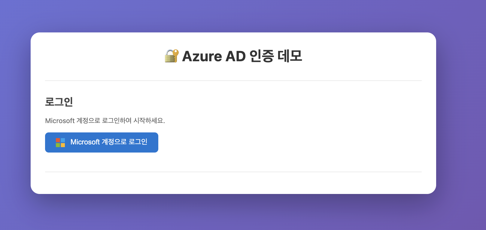
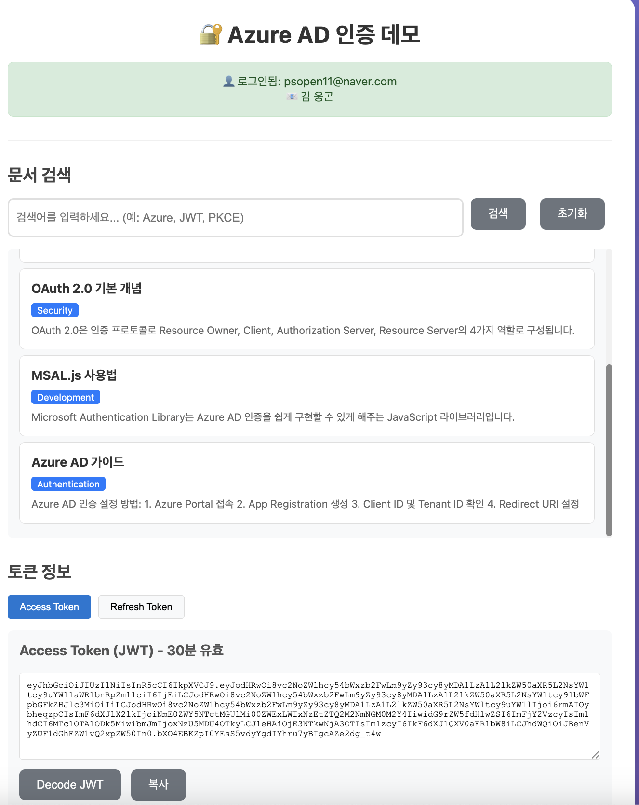

# Azure AD Authentication Demo

Azure Active Directory를 활용한 JWT 토큰 기반 인증 시스템 데모 프로젝트입니다.

## 목차
1. [프로젝트 개요](#프로젝트-개요)
2. [인증 원리](#인증-원리)
3. [프로젝트 구조](#프로젝트-구조)
4. [환경 설정](#환경-설정)
5. [실행 방법](#실행-방법)
6. [사용 방법](#사용-방법)
7. [API 엔드포인트](#api-엔드포인트)
8. [보안 기능](#보안-기능)
9. [문제 해결](#문제-해결)

---

## 프로젝트 개요

이 프로젝트는 다음과 같은 기능을 구현합니다:

- **Azure AD 인증**: Microsoft 계정으로 로그인
- **JWT 토큰 관리**: Access Token (30분) + Refresh Token (7일)
- **자동 토큰 갱신**: 만료 시 자동 갱신
- **문서 검색**: 인증된 사용자만 접근 가능한 API
- **PKCE 보안**: Client Secret 없이 안전한 인증

### 기술 스택
- **Frontend**: HTML/CSS/JavaScript + MSAL.js
- **Backend**: ASP.NET Core 8.0 (macOS 지원)
- **Database**: SQLite
- **Authentication**: Azure AD + JWT

---

## 인증 원리

### 1. **전체 인증 플로우**

```
┌──────────────┐      ┌──────────────┐      ┌──────────────┐      ┌──────────────┐
│   Browser    │      │   Azure AD   │      │  App Server  │      │   Database   │
└──────────────┘      └──────────────┘      └──────────────┘      └──────────────┘
       │                     │                      │                      │
       │ 1. Login Click      │                      │                      │
       ├────────────────────>│                      │                      │
       │                     │                      │                      │
       │ 2. Login Page       │                      │                      │
       │<────────────────────│                      │                      │
       │                     │                      │                      │
       │ 3. User Credentials │                      │                      │
       ├────────────────────>│                      │                      │
       │                     │                      │                      │
       │ 4. Azure Token      │                      │                      │
       │<────────────────────│                      │                      │
       │                     │                      │                      │
       │ 5. Send Azure Token │                      │                      │
       ├─────────────────────────────────────────>│                      │
       │                     │                      │                      │
       │                     │ 6. Verify Token     │                      │
       │                     │<────────────────────│                      │
       │                     │                      │                      │
       │                     │ 7. Token Valid      │                      │
       │                     ├────────────────────>│                      │
       │                     │                      │                      │
       │                     │                      │ 8. Create/Get User  │
       │                     │                      ├─────────────────────>│
       │                     │                      │<─────────────────────│
       │                     │                      │                      │
       │ 9. JWT Tokens (Access + Refresh)          │                      │
       │<──────────────────────────────────────────│                      │
       │                     │                      │                      │
```

### 2. **PKCE (Proof Key for Code Exchange) 동작 원리**

PKCE는 Public Client (JavaScript 앱)에서 Client Secret 없이 안전하게 인증하는 방법입니다.

```javascript
// PKCE 프로세스 (MSAL.js가 자동 처리)

1. Code Verifier 생성 (랜덤 문자열)
   verifier = "dBjftJeZ4CVP-mB92K27uhbUJU1p1r_wW..."

2. Code Challenge 생성 (SHA256 해시)
   challenge = SHA256(verifier) = "E9Melhoa2OwvFrEMTJguCHaoeK1t8URWbuGJSstw-cM"

3. Azure AD로 인증 요청 (Challenge 포함)
   → 사용자 로그인
   → Authorization Code 받기

4. Code를 Token으로 교환 (Verifier 증명)
   → Azure AD가 SHA256(verifier) == challenge 확인
   → 일치하면 Token 발급
```

### 3. **JWT Token 구조**

JWT는 세 부분으로 구성됩니다:

```
Header.Payload.Signature

예시:
eyJhbGciOiJIUzI1NiIsInR5cCI6IkpXVCJ9.  // Header
eyJzdWIiOiIxIiwiZW1haWwiOiJ1c2VyQGV4YW1wbGUuY29tIn0.  // Payload
XbPfbIHMI6arZ3Y922BhjWgQzYzwCV...  // Signature
```

디코딩하면:
```json
// Header
{
  "alg": "HS256",  // 서명 알고리즘
  "typ": "JWT"     // 토큰 타입
}

// Payload
{
  "sub": "1",                        // User ID
  "email": "user@example.com",       // Email
  "azure_id": "azure_123",          // Azure ID
  "exp": 1700000060,               // 만료 시간
  "iat": 1700000000                // 발급 시간
}
```

### 4. **Access Token vs Refresh Token**

| 구분 | Access Token | Refresh Token |
|-----|--------------|---------------|
| **용도** | API 호출 인증 | Access Token 재발급 |
| **수명** | 30분 | 7일 |
| **저장 위치** | localStorage | localStorage + DB |
| **갱신 방법** | Refresh Token 사용 | 재로그인 필요 |
| **보안 수준** | 짧은 수명으로 리스크 최소화 | DB 저장으로 무효화 가능 |

---

## 프로젝트 구조

```
AzureAuthDemo/
├── Backend/                     # ASP.NET Core API 서버
│   ├── Controllers/
│   │   ├── AuthController.cs    # 인증 관련 API
│   │   └── DocumentsController.cs # 문서 검색 API
│   ├── Services/
│   │   ├── AzureAuthService.cs  # Azure AD 토큰 검증
│   │   └── JwtService.cs        # JWT 토큰 생성
│   ├── Models/
│   │   └── Models.cs            # 데이터 모델
│   ├── Data/
│   │   └── AppDbContext.cs      # Entity Framework 설정
│   ├── Program.cs               # 앱 진입점
│   ├── appsettings.json         # 설정 파일
│   └── Backend.csproj           # 프로젝트 파일
│
├── Frontend/                    # 웹 클라이언트
│   ├── index.html              # 메인 HTML
│   ├── style.css               # 스타일시트
│   └── auth.js                 # 인증 및 API 로직
│
└── README.md                   # 이 파일
```

---

## 환경 설정

### 1. **필수 요구사항**

- **.NET 8.0 SDK** (macOS/Windows/Linux)
  ```bash
  # 설치 확인
  dotnet --version
  
  # 설치 필요시
  brew install --cask dotnet-sdk  # macOS
  ```

- **Node.js** 또는 **Python** (Frontend 서버용)
- **Azure AD 계정** (무료 계정 가능)

### 2. **Azure AD 앱 등록**

1. [Azure Portal](https://portal.azure.com) 접속
2. **Azure Active Directory** → **App registrations** → **New registration**
3. 설정 입력:
   - Name: `AzureAuthDemo`
   - Supported account types: `Accounts in any organizational directory`
   - Redirect URI: Platform `Single-page application`, URI `http://localhost:3000`

4. 생성 후 정보 확인:
   ```
   Application (client) ID: b932f9cd-e8d5-46ce-bd37-8a0f3aca4373
   Directory (tenant) ID: 6c01af9b-e68a-4616-bcc6-4685d9acd910
   ```

5. **API Permissions** 설정:
   - Microsoft Graph → Delegated permissions
   - ✅ openid
   - ✅ profile
   - ✅ email
   - ✅ User.Read

6. **Authentication** 설정:
   - Platform configurations → Single-page application
   - Implicit grant and hybrid flows:
     - ☐ Access tokens (체크 안함)
     - ☑ ID tokens (체크)

### 3. **프로젝트 설정**

Backend 설정 파일 확인 (`Backend/appsettings.json`):
```json
{
  "AzureAd": {
    "TenantId": "6c01af9b-e68a-4616-bcc6-4685d9acd910",  // 실제 Tenant ID
    "ClientId": "b932f9cd-e8d5-46ce-bd37-8a0f3aca4373"   // 실제 Client ID
  }
}
```

Frontend 설정 확인 (`Frontend/auth.js`):
```javascript
const msalConfig = {
    auth: {
        clientId: "b932f9cd-e8d5-46ce-bd37-8a0f3aca4373",  // 실제 Client ID
        authority: "https://login.microsoftonline.com/6c01af9b-e68a-4616-bcc6-4685d9acd910"  // Tenant ID
    }
};
```

---

## 실행 방법

### 1. **Backend 서버 실행**

```bash
# Terminal 1
cd ~/Desktop/AzureAuthDemo/Backend

# 패키지 복원
dotnet restore

# Entity Framework 도구 설치 (처음 한번만)
dotnet tool install --global dotnet-ef

# 데이터베이스 마이그레이션
dotnet ef migrations add InitialCreate
dotnet ef database update

# 서버 실행
dotnet run

# 출력 예시:
# info: Microsoft.Hosting.Lifetime[14]
#       Now listening on: http://localhost:5000
# info: Microsoft.Hosting.Lifetime[0]
#       Application started. Press Ctrl+C to shut down.
```

Swagger UI 접속: http://localhost:5000/swagger

### 2. **Frontend 서버 실행**

```bash
# Terminal 2
cd ~/Desktop/AzureAuthDemo/Frontend

# Python 3 사용
python3 -m http.server 3000

# 또는 Node.js 사용
npx http-server -p 3000

# 또는 Live Server VS Code Extension 사용
```

브라우저에서 접속: http://localhost:3000

---

## 사용 방법

### 1. **로그인**
1. 브라우저에서 http://localhost:3000 접속
2. "Microsoft 계정으로 로그인" 버튼 클릭
3. Microsoft 계정 입력 (회사/학교 계정 또는 개인 계정)
4. 권한 동의 화면에서 "Accept" 클릭



### 2. **문서 검색**
- 로그인 후 자동으로 문서 목록 표시
- 검색창에 키워드 입력 (예: "Azure", "JWT", "PKCE")
- Enter 키 또는 "검색" 버튼 클릭

### 3. **토큰 확인**
- Access Token 탭: 30분 유효한 JWT 토큰
- Refresh Token 탭: 7일 유효한 갱신 토큰
- "Decode JWT" 버튼: 토큰 내용 확인
- 타이머: 토큰 만료까지 남은 시간 표시



### 4. **토큰 갱신**
- Access Token 만료 5분 전 경고 표시
- "토큰 갱신" 버튼 클릭 또는 자동 갱신
- Refresh Token으로 새 Access Token 발급

### 5. **로그아웃**
- "로그아웃" 버튼 클릭
- 모든 토큰 무효화 및 Azure AD 로그아웃

---

## API 엔드포인트

### **인증 API**

#### `POST /api/auth/login`
Azure 토큰으로 로그인
```javascript
// Request
{
  "azureToken": "eyJ0eXAiOiJKV1..."
}

// Response
{
  "accessToken": "eyJhbGciOiJIUzI1...",
  "refreshToken": "eyJhbGciOiJIUzI1...",
  "expiresIn": 1800,
  "userEmail": "user@example.com"
}
```

#### `POST /api/auth/refresh`
토큰 갱신
```javascript
// Request
{
  "refreshToken": "eyJhbGciOiJIUzI1..."
}

// Response
{
  "accessToken": "eyJhbGciOiJIUzI1...",
  "refreshToken": "eyJhbGciOiJIUzI1...",
  "expiresIn": 1800
}
```

#### `POST /api/auth/logout`
로그아웃 (Authorization 필요)

#### `GET /api/auth/validate`
토큰 유효성 확인 (Authorization 필요)

### **문서 API**

#### `GET /api/documents`
문서 목록 조회 (Authorization 필요)
```
GET /api/documents?search=Azure
Authorization: Bearer eyJhbGciOiJIUzI1...
```

#### `GET /api/documents/{id}`
특정 문서 조회 (Authorization 필요)

---

## 보안 기능

### 1. **PKCE (Proof Key for Code Exchange)**
- Client Secret 없이 안전한 인증
- Authorization Code 가로채기 공격 방지

### 2. **Token Rotation**
- Refresh Token 사용 시 새로운 Refresh Token 발급
- 기존 토큰 무효화

### 3. **Rate Limiting**
- 분당 5회 로그인 시도 제한
- Brute force 공격 방지

### 4. **JWT 검증**
- 서명 검증
- 만료 시간 검증
- Issuer/Audience 검증

### 5. **CORS 설정**
- localhost:3000만 허용
- Credentials 포함

---

## 문제 해결

### **문제 1: 로그인 팝업이 차단됨**
**해결**: 브라우저 팝업 차단 해제 또는 리다이렉트 방식 사용

### **문제 2: CORS 에러**
**해결**: Backend가 http://localhost:5000 에서 실행 중인지 확인

### **문제 3: 401 Unauthorized**
**해결**: 
1. Access Token 만료 확인
2. Refresh Token으로 갱신
3. 재로그인

### **문제 4: Azure 로그인 실패**
**해결**:
1. Client ID, Tenant ID 확인
2. Redirect URI가 정확한지 확인 (http://localhost:3000)
3. API Permissions 확인

### **문제 5: Database 에러**
**해결**:
```bash
# DB 파일 삭제 후 재생성
rm Backend/app.db
dotnet ef database update
```

### **문제 6: 포트 충돌**
**해결**:
```bash
# 5000 포트 사용 중인 프로세스 확인 (macOS)
lsof -i :5000
kill -9 [PID]

# 3000 포트 사용 중인 프로세스 확인
lsof -i :3000
kill -9 [PID]
```

---

## 토큰 생명주기

```
[최초 로그인]
     ↓
[Access Token: 30분]
[Refresh Token: 7일]
     ↓
[30분 경과]
     ↓
[Access Token 만료]
     ↓
[Refresh Token으로 갱신]
     ↓
[새 Access Token: 30분]
[새 Refresh Token: 7일]  ← Token Rotation
     ↓
[7일 경과]
     ↓
[모든 토큰 만료]
     ↓
[재로그인 필요]
```

---

## 참고 자료

- [Microsoft Identity Platform 문서](https://docs.microsoft.com/azure/active-directory/develop/)
- [MSAL.js 문서](https://github.com/AzureAD/microsoft-authentication-library-for-js)
- [JWT.io](https://jwt.io/) - JWT 디버거
- [ASP.NET Core 인증](https://docs.microsoft.com/aspnet/core/security/authentication/)
- [PKCE 설명](https://oauth.net/2/pkce/)

---

## 라이선스

이 프로젝트는 Azure 인증 연습 목적으로 만들었습니다.

---
